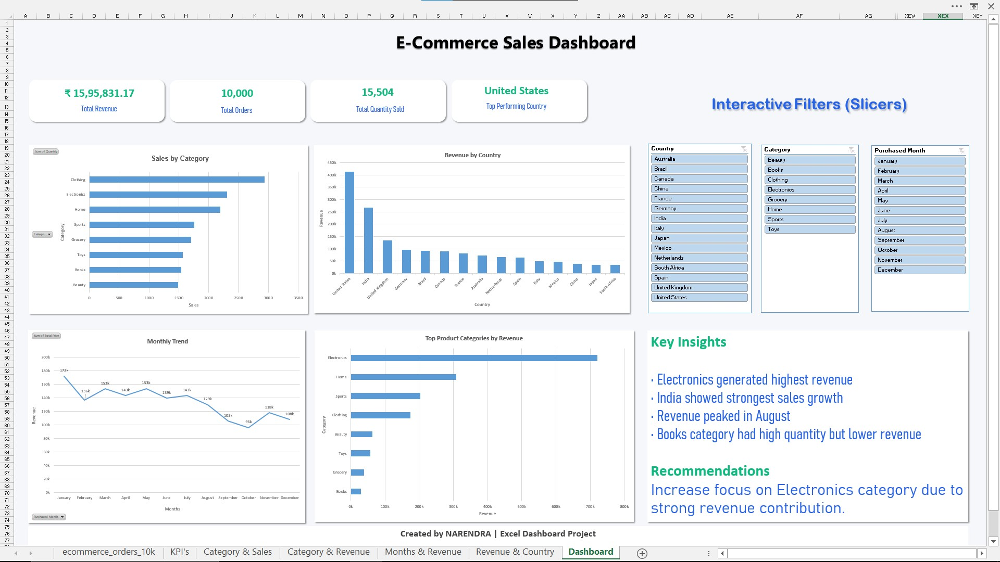

# E-Commerce Sales Analysis Dashboard

## Project Overview

This project is an interactive E-Commerce Sales Dashboard created in Excel to analyze sales performance, revenue trends, product categories, and country-wise business insights.

The dashboard helps in understanding:

* Sales performance by category
* Revenue contribution by country
* Monthly sales trends
* Top-performing product categories
* Business insights and recommendations

---

## Tools Used

* Microsoft Excel
* Pivot Tables
* Pivot Charts
* Slicers
* Data Visualization

---

## Dataset Information

The dataset contains:

* Product Categories
* Revenue
* Quantity Sold
* Country-wise Sales
* Monthly Sales Data
* Order Details

---

## Business Questions Solved

* Which category generated the highest revenue?
* Which country contributed the highest sales?
* What are the monthly revenue trends?
* Which product categories performed best?
* What business insights can be derived from the sales data?

---

## Dashboard Features

* Interactive slicers for filtering data
* KPI cards for quick business overview
* Revenue trend analysis
* Country-wise performance analysis
* Category-wise sales visualization
* Key business insights and recommendations

---

## Key Insights

* Electronics generated the highest revenue
* India showed strong sales growth
* Revenue peaked during August
* Books category had high quantity but lower revenue contribution

---

## Recommendation

Increase focus on Electronics category due to its strong revenue contribution and customer demand.

---

## Project Outcome

This project improved my understanding of:

* Exploratory Data Analysis (EDA)
* Business-focused dashboard creation
* Interactive reporting in Excel
* Data storytelling and visualization

